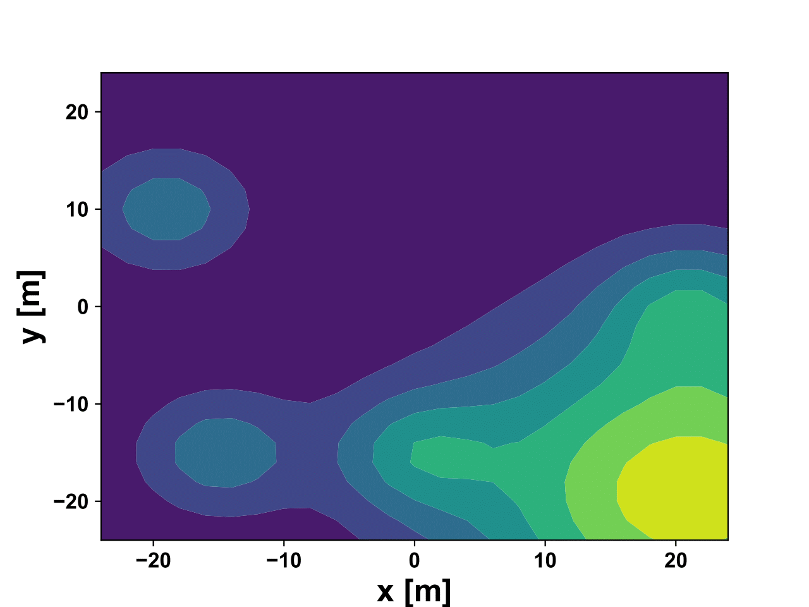

# Bayes-Swarm with the down-samplers for Env2

Env2:  

Each folder has codes implementation of Bayes-Swarm with the respective down-sampler

The down-samplers have been implemented in BayesSwarm/filtering.py 
